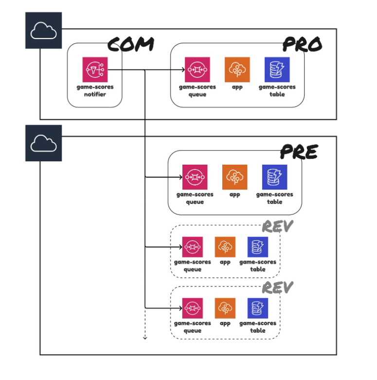
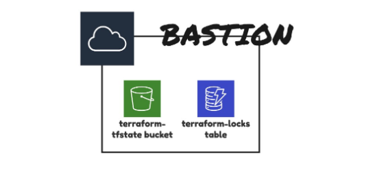

## Requisitos
Vamos revisar quais casos de uso a estrutura proposta abrangerá:

* AWS como provedor de nuvem. Isso também pode ser aplicado a outros, pois o Terraform oferece suporte a muitos provedores diferentes.
* Configuração de várias contas da AWS. Uma conta para cargas de trabalho de produção e outra para fins de teste.
* Recursos cruciais (por exemplo, banco de dados) implantados manualmente e sob demanda.
* Ambientes dinâmicos de curta duração para dar suporte a aplicativos para filiais.
* Compartilhamento e referência de recursos criados por outra configuração do Terraform.
* Desenvolvimento local sem atrito.
* Capacidade de fazer deploy a partir de uma máquina local sem um fluxo de autenticação complexo.
* Atuar no contexto de uma determinada conta da AWS assumindo uma função.
* Tfstates armazenados em uma conta da AWS separada.

## Contexto
O diagrama da infraestrutura gerenciada pelo repositório é mostrado abaixo. Conforme mencionado, temos duas contas da AWS nas quais nossa infraestrutura opera. Você provavelmente está familiarizado com essa configuração, pois é bastante comum. 
Existe algum tipo de tópico que transmite eventos que podem ser consumidos por muitas filas e processados ​​por um aplicativo. O resultado disso precisa ser armazenado em armazenamento persistente, que no nosso caso é uma tabela do DynamoDB.


## Os recursos são atribuídos a um determinado ambiente:

* com (comum). Conjunto de componentes compartilhados por muitos. No exemplo, temos um tópico game-score no AWS SNS que pode ter muitos consumidores.

* profissional (produção)

* pré (pré-produção). Um ambiente para fins de teste. Atua como um portão antes da produção. Espelha o ambiente de produção.

* rev (revisão). Ambientes dinâmicos de curta duração. provisionado sob demanda. Podemos ter muitos deles. Cópia do ambiente de pré-produção.

## Estrutura proposta
```
.
├── infrastructure
│   ├── environments
│   │   ├── com
│   │   ├── pre
│   │   ├── pro
│   │   │   ├── config.tf
│   │   │   ├── db
│   │   │   │   ├── config.tf
│   │   │   │   ├── main.tf
│   │   │   │   ├── outputs.tf
│   │   │   │   └── variables.tf
│   │   │   ├── main.tf
│   │   │   ├── outputs.tf
│   │   │   └── variables.tf
│   │   └── rev
│   └── modules
│       ├── app
│       │   ├── main.tf
│       │   ├── outputs.tf
│       │   └── variables.tf
│       ├── db
│       └── queue
├── package.json
└── src
    └── index.js
```    
Antes de começarmos a dividir a ideia em fatores primos, vamos verificar como é simples e explícito implantar no pré e no pro a partir de uma máquina local.

```bash
$ cd infraestrutura/ambientes/pre 
$ terraform init 
$ terraform apply 
$ cd ../../../infrastructure/environments/pro 
$ terraform init 
$ terraform apply
```

Isso funciona para sistemas bastante complexos à medida que o usamos em nosso projeto. 
Achei essa facilidade de implantação (e de reversão se algo der errado) muito fácil.

## Vamos analisar a estrutura de pastas e partir do topo.
```
├── infrastructure # configurações do terraform
└── src            # codigo da app 
```
Em um diretório, mantemos as coisas relacionadas à infraestrutura e, no segundo, mantemos um código do aplicativo.

## A essência da estrutura
Indo mais fundo na pasta "infrastructure", você encontrará "environments" e "modules". 
Dentro do "environments", temos um diretório separado para cada ambiente. No "modules", você encontra módulos Terraform importados por pelo menos dois ambientes (DRY).

Essa é a essência dessa estrutura e o que define por ela ser tão boa. 
Você pode ficar tentado a usar uma abordagem orientada à configuração do Terraform, mas, dependendo da entrada, ela gera resultados diferentes. 
Se você tem três ambientes semelhantes (pre, pro, rev), por que não criar um módulo Terraform e chama-lo com uma configuração armazenada em um arquivo json? 
Essa ideia pode ser influenciada pelo capítulo de "configuration" da metodologia Twelve-Factor, mas está relacionada a um código de aplicativo (independente do ambiente), 
não a um código de infraestrutura (basicamente descreve ambientes). 
É assim que a implantação do ambiente pré pode ser executada.

```bash
terraform apply -var-file="pre.tfvars.json"
```

Se você usar uma abordagem orientada à configuração, mais cedo ou mais tarde acabará com muitas declarações condicionais e outros hacks bizarros. 
O Terraform é uma ferramenta destinada a criar descrições declarativas de sua infraestrutura, portanto, não introduza imperatividade. 
Ao preparar módulos Terraform separados para cada ambiente, vemos as coisas como elas se parecem na realidade. Temos um mapeamento direto e explícito entre o código e um estado do Terraform. 
Reduzimos o WTFs/minute. 
A solução proposta terá mais linhas de código, mas ainda deixará espaço para reutilização de código. Não se esqueça dos módulos!

“Qualquer tolo pode escrever um código que um computador possa entender. 
 Bons programadores escrevem código que os humanos podem entender.” 
 — por Martin Fowler

Apenas uma observação sobre os workspaces. Não o use para diferenciar ambientes. [Mesmo os autores não recomendam isso](https://www.terraform.io/language/state/workspaces#when-to-use-multiple-workspaces) . Depois, apresentarei um bom caso de uso para workspaces.

## Conta secundaria da AWS
Como é possível não precisar reautenticar (ou alterar um valor de AWS_PROFILE) quando estou alternando um contexto de contas da AWS?

```bash
cd infraestructure/environments/pre 
$ terraform apply 
# Recursos implantados na conta AWS de teste $ cd ../../../infrastructure/environments/pro $ terraform apply 
# Recursos implantados na conta AWS de produção # E simplesmente funciona
```
Em qualquer config.tf contidos nos módulo raiz dos environments, você encontrará a seguinte bloco:

```tf
provider "aws" {
  # ...

  assume_role {
    role_arn = "arn:aws:iam::${var.aws_account_id}:role/AssumableAdmin"
  }

  # ...
}
```

Esta parte é responsável por assumir um papel. Essa abordagem é descrita no guia do Terraform Use AssumeRole para provisionar recursos da AWS entre contas . 
A ideia de assumir é bem simples. Permite que a conta A da AWS atue no contexto da conta B da AWS. No nosso caso, permite que a conta bastion atue no contexto de produção ou conta de teste na AWS. 

O que é uma conta bastion? Vou escrever sobre ela em outro artigo com mais detalhes. Por enquanto, você só precisa saber que estamos usando essa conta para centralizar o gerenciamento de permissões do IAM, armazenamento de tfstate e bloqueios. 
Para provisionar com o Terraform, você precisa de um usuário do IAM, um bucket do S3 e uma tabela do DynamoDB. Você enfrentará um dilema da galinha ou do ovo. Decidimos mover essa parte para uma conta separada da AWS (bastion). Ele nos permite (em teoria) recriar todos os recursos em uma determinada conta da AWS apenas executando o Terraform.




Xablauu… e config.tf

```tf
. 
└── infraestrutura 
    └── ambientes 
        └── pro 
            ├── config.tf
             ├── main.tf
             ├── outputs.tf
             └── variables.tf
```             

Cada módulo raiz consiste em 4 arquivos, nem mais, nem menos. Cada um tem seu papel claramente especificado.

* config.tf. Para não introduzir ruído no topo do arquivo main.tf, decidimos mover a configuração do backend e dos provedores para um arquivo separado.
* main.tf. Aqui, você encontrará definições de todos os recursos gerenciados por um módulo.
* outputs.tf. Conjunto de saídas do módulo. Você pode consumi-los ainda mais em scripts de shell ou referenciá-los no módulo pai.
* variables.tf. Conjunto de entradas de módulos. Para cada valor, sempre especificamos o argumento de descrição para fins de autodocumentação. Pense neles como campos de *classe pública*, enquanto os valores definidos no bloco local são *privados*.

## Componentes de porcelana
Existem algumas situações em que você não deseja dar controle sobre seus recursos a scripts automatizados em seu pipeline de CI/CD. Você consegue pensar em algum? Muitas vezes, é um banco de dados . Quem sabe o que pode acontecer quando você faz um push na branch master? Todos nós conhecemos histórias em que um banco de dados capotou de repente: porque uma atualização de uma versão ou tipo de instância foi acionada. Portanto, às vezes você gostaria de implantar alterações sob demanda e de sua máquina local na frente de todos. Vamos ver como isso pode ser na prática.

Abaixo segue nossa estrutura.

```bash
. 
└── infraestructure
    └── environments 
        └── pro 
            ├── config.tf 
            ├── db
             │ ├── config.tf 
            │ ├── main.tf
             │ ├── outputs.tf │ └── outputs.tf 
            │ └─ 
            ├── main.tf
             ├── outputs.tf 
            └── variables.tf
```
Provisionamento de recursos em ambiente pro usando uma linha de comando.

```bash
$ cd infraestructure/environments/pro 
$ terraform apply 
# Todos os recursos exceto um banco de dados foram implantados
 $ cd db 
$ terraform apply 
# Apenas um banco de dados foi implantado
```

## Ambientes dinâmicos
Você já ouviu falar sobre review apps? É uma estratégia de deploy, git flow. Digamos que você esteja trabalhando em alguma feature e queira dar ao seu PM ou outros desenvolvedores a capacidade de testá-los antes de fazer merge na branch master e sem pedir que eles testem em um ambiente local. Se você tiver uma configuração sem servidor, não custará quase nada, pois você paga pelo uso, não pelos recursos implantados em si. No repositório, você encontrará um arquivo .tarvis.yml onde poderá encontrar como aplicar esta estratégia. A ideia é simples. Para cada commit na branch de feature, você provisiona um ambiente que espelha o ambiente anterior. Este é o caso de uso perfeito para workspaces do Terraform!

*- O uso comum para multiplos workspaces é para criar uma cópia paralela e distinta de um conjunto de infraestrutura para testar um conjunto de alterações antes de modificar a infraestrutura de produção principal.*

*- workspaces não default geralmente estão relacionados a feature branchs no repositório.*

Como é na prática? 
Dê uma olhada no arquivo main.tf no direorio rev. Basicamente, apenas importamos e usamos o módulo pre. 
Como teremos muitos ambientes diferentes nas mesmas contas da AWS (já que os ambientes pré e rev são implantados na conta de teste da AWS), precisamos distingui-los de alguma forma. Podemos marcá-los e anexar um prefixo aos nomes dos recursos.

```tf
moodule "deployment" {
  source = "../pre"

  environment = terraform.workspace
  prefix      = "${terraform.workspace}-"
}
```
O provisionamento e a destruição de ambientes de revisão podem ser feitos facilmente a partir da CLI.

```bash
$ cd infrastructure/environments/rev
$ terraform init
# # Para provisioná-los
# Revise o aplicativo chamado foo-1
$ terraform workspace new foo-1
$ terraform apply
# Revise o aplicativo chamado bar-2
$ terraform workspace new bar-2
$ terraform apply
# Para destruí-los
# Revise o aplicativo chamado foo-1
$ terraform workspace select foo-1
$ terraform destroy
$ terraform workspace delete foo-1
# Revise o aplicativo chamado bar-2
$ terraform workspace select bar-2
$ terraform destroy
$ terraform workspace delete bar-2
```

## Compartilhamento e referência

Na arquitetura apresentada, temos um tópico que transmite eventos para muitos consumers. Os consumers estão em ambientes diferentes. Temos uma parte comum para cada um deles. Soa familiar? Novamente, um cenário bastante comum para o qual precisamos estar preparados.

Onde você deve colocar esses recursos? No ambiente pro? No CI/CD, você preferencialmente implantaria o ambiente pré antes do pro. Se pre tiver uma dependência na forma de pro, ela poderá ser interrompida por alguns minutos até que todo o processo de implantação termine. Essa dependência também é bastante oculta. Para enfrentar este problema pode-se criar um ambiente comum artificial, que chamamos de com. Esse ambiente é sempre implantado como primeiro. Para referenciar recursos criados por com em pre ou pro , basta ler os valores de saída (você se lembra do arquivo outputs.tf?) no módulo com. Os valores são armazenados em um tfstate.

```tf
data "terraform_remote_state" "common" {
  backend = "s3"
  config = {
    dynamodb_table = "terraform-locks"
    bucket         = "terraform-tfstate-payment"
    encrypt        = true
    key            = "infrastructure/environments/com/template-terraform-folder-strucutre/common.tfstate"
    region         = "eu-north-1"
    role_arn       = "arn:aws:iam::<bastion_account_id>:role/TerraformState"
  }
}

resource "aws_sns_topic_subscription" "results_updates_sqs_target" {
    topic_arn = data.terraform_remote_state.common.outputs.sns_game_scores_arn
    protocol  = "sqs"
    endpoint  = aws_sqs_queue.game_scores.arn
}
```

## Resumo
Todas as dicas que mostrei foram testadas em cenários de casos reais e em ambientes de produção. 
Com eles, você será capaz de domar a maioria dos cenários. Use-os como inspiração para criar soluções que atendam às suas necessidades.


